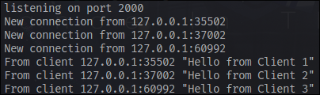

## Experiment 2.1 Original Code and How It Run
The server needs to be run first, then run the clients. What happens here is that when a client writes a message, it will be sent to all of the clients in real time.