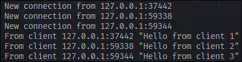
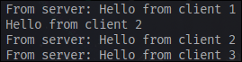
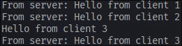

## Experiment 2.1 Original Code and How It Run
The server needs to be run first, then run the clients. What happens here is that when a client writes a message, it will be sent to all of the clients in real time.

## Experiment 2.2 Modifying Websocket Port
Changing the websocket port in `client.rs` means that the port in `server.rs` needs to be changed as well. To do so, the listener code must be modified.

```rust
let listener = TcpListener::bind("127.0.0.1:8080").await?;
    println!("listening on port 8080");
```

They both need to have the same port because the clients will be listening to the server's port.

## Experiment 2.3 Small Changes
To add information of client when a message is sent, the `bcast_tx` is modified to contain the address of client.

```rust
if let Some(text) = msg.as_text() {
    println!("From client {addr:?} {text:?}");
    bcast_tx.send(format!("{} : {}", addr, text))?;
}
```

Here is the result of doing so.


